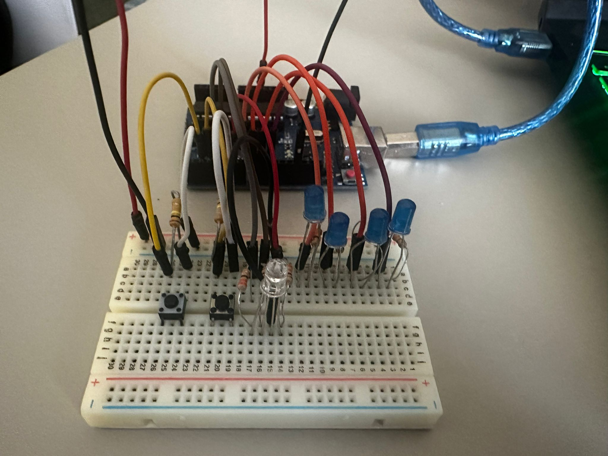

# Introducere in Robotica - Tema #1

# Simularea unei statii de incarcare a vehiculelor electrice

## Descrierea sarcinii
Acest proiect simuleaza o statie de incarcare a vehiculelor electrice de baza folosind un Arduino Uno, LED-uri si butoane. Sistemul alterneaza intre doua stari principale:

- **Disponibil**: Statia este libera, iar LED-ul RGB indica acest lucru cu o lumina verde.
- **Incarcare**: Statia incepe sa incarce un vehicul, unde LED-ul RGB devine rosu, iar cele patru LED-uri de progres reprezinta nivelul de incarcare (25%, 50%, 75%, 100%).

Apasarea scurta a butonului de start va porni incarcarea, dar apasarea acestui buton in timpul incarcarii nu va face nimic.
In schimb, apasarea lunga a butonului de stop va opri incarcarea fortat si va reseta statia la starea libera cu toate ca apasarea acestui buton cat timp statia este libera nu va face nimic.

## Componente
- **Arduino Uno**
- **1x LED RGB** (pentru a indica starea statiei)
- **4x LED-uri** (pentru a simula progresul incarcarii)
- **2x Butoane push** (Start si Stop)
- **6x Rezistente de 220Ω** (pentru limitarea curentului)
- **2x Rezistente de 1kΩ** (pentru pull-down la butoane)
- **Breadboard**
- **Fire de legatura**

## Prezentare functionala

### LED RGB: Arata disponibilitatea statiei:
- **Verde**: Statia este libera (nu incarca).
- **Rosu**: Statia incarca un vehicul.

### 4 LED-uri de progres: Simuleaza procentajul de incarcare:
- **L1** (25%)
- **L2** (50%)
- **L3** (75%)
- **L4** (100%)

### Butoane:
- **Butonul Start**: O apasare initiaza procesul de incarcare daca statia este disponibila. In alte cazuri, butonul nu are efect.
- **Butonul Stop**: Apasand si tinand apasat timp de cel putin 1 secunda opreste procesul de incarcare.

## Demonstratie Video
[Demonstratie Video](https://youtube.com/shorts/J3dgeJ_FG_0)  

## Procesul de incarcare
1. Cand incepe incarcarea, LED-ul RGB devine rosu.
2. Primul LED de progres (L1) clipeste timp de 3 secunde (reprezentand o incarcare de 25%) si apoi ramane aprins.
3. Urmatorul LED (L2) clipeste timp de 3 secunde, reprezentand 50%, iar acest lucru continua pentru L3 si L4 (pana la 100%).
4. Dupa finalizarea incarcarii, toate LED-urile clipesc de 3 ori pentru a semnala sfarsitul procesului.
5. Daca butonul stop este tinut apasat in timpul incarcarii, procesul se opreste, toate LED-urile clipesc de 3 ori, iar LED-ul RGB devine verde.

## Cod
Codul Arduino utilizat in proiect consta in mai multe functii:

### Prezentarea functiilor

- **`void pornesteIncarcarea()`**: Porneste procesul de incarcare. Seteaza starea statiei la "indisponibil", actualizeaza etapa de incarcare la 1 si schimba LED-ul RGB la rosu.

- **`void opresteIncarcarea()`**: Opreste fortat procesul de incarcare. Reseteaza starea de incarcare, actualizeaza starea statiei la "disponibil" si face toate LED-urile sa clipesca de trei ori pentru a indica sfarsitul incarcarii. Aceasta functie este apelata la apasarea continua de 1 secunda a butonului stop.

- **`void finalizeazaIncarcarea()`**: Finalizeaza procesul de incarcare folosind aproape tot din `opresteIncarcarea()`, dar cu mici ajustari. Aceasta functie este executata cand incarcarea ajunge la 100%.

- **`void actualizeazaLEDuriIncarcare()`**: Actualizeaza starea LED-urilor de progres in functie de etapa curenta de incarcare. Gestioneaza comportamentul de clipire al fiecarui LED pentru a indica progresul incarcarii.

- **`void resetareLEDuriIncarcare()`**: Reseteaza starea tuturor LED-urilor de progres la OFF.

## Schema electrica (TinkerCAD)

## Aranjarea PIN-urilor
- **RGB LED:**
  - Red: Pin 6
  - Green: Pin 4
  - Blue: Pin 5
  - L1 (25%): Pin 10
  - L2 (50%): Pin 9
  - L3 (75%): Pin 8
  - L4 (100%): Pin 7
- **Buton Start**: Pin 3
- **Buton Stop**: Pin 2

## Poze ale ansamblului

